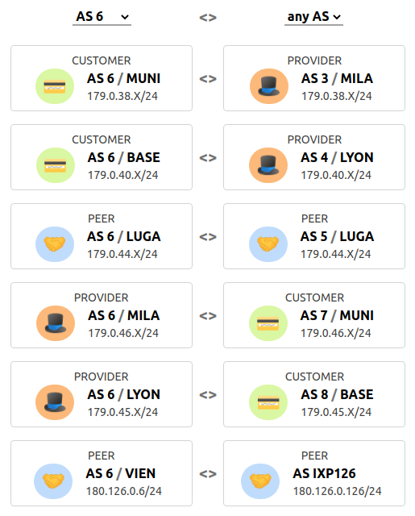

# Inter-Domain Routing

Now that you have achieved connectivity within you AS, the next step is to
enable connectivity between the different ASes.
Configure the external BGP sessions (eBGP) with your neighboring ASes
(including the IXPs).
You can see with which ASes you are directly connected to and with which
IP subnet on the *connections* page of the mini-Internet website.
You can negotiate with your neighboring ASes and agree on which IP addresses
should be used by you and your peer.

## Configure eBGP sessions

For every eBGP session, the mini-Internet website indicates the business
relationship that rules this session, which router is connected to the
neighboring AS, and what subnet you should use for that session.

{: .note }
If one of your routers is connected to a router that is an AS operated by the
TA team, we explicitly indicate which IP address to use.

You can set some filters on the webpage to only see the BGP sessions that
relate to your group.
The screenshot below is an example of what the *connections* page tells
us for group 6.

We see that AS 6 has two peers (AS5 and IXP126), two customer (AS7 and AS8),
and two providers (AS3 and AS4).
AS6 is connected to IXP126 via its router `VIEN`.
In this case, you might configure the IP address `180.126.0.6/24` on the
interface of `VIEN` conected to the IXP.
In our mini-Internet, the AS number of an IXP is its identifier.
For example, IXP125 has the S number 126. The IP address of the IXP router
server is `180.Z.0.Z` with Z being the AS number of the IXP.
The router server of IXP126, for example, has the IP address `180.126.0.126`.

{: .note }
By default, IXPS are configured not to relay BGP advertisements to their peers.
Thurs, it is normal if you do not see your prefixes advertised through the IXP.

Once the eBGP sessions are established, advertise your prefix to your peers.
You must only advertise the /8 that has been assigned to you.
In the mean time, your peers should advertise to you their /8 prefix, as well
as the prefixes they have learned (since there are no BGP policies yet).

💡 For this excerciese you will have to use the `next-hop-self` command when
you configure external BGP sessions.

{: .highlight }
Tutorial on how to [configure BGP](../tutorial/routing/BGP).

## Configure BGP policies

Configure your local preferences as well as the exportation rules to implement
the customer-provider and peer-peer business relationships with your neighbors.
The connections you have through your IXP must be considered as peer-peer
connections.

{: .note }
Keep in mind that the default behavior of the IXP route server is to not
relay the BGP advertisements, thus for now the prefixes you advertise your
will not be propagated to the other IXP's participants. Yet, you can already
configure the exportation rules for the eBGP session you have with your IXP.

💡 To configure the exportation rules, you can tag incoming routes using
BGP communities to keep track of where the routes you have learned came from,
and then math on the tag when exporting the routes.
Verify using `traceroute` or with the looking glass that the paths used do
respect the business relationships.

{: .highlight }
Tutorial on how to [configure BGP policies](../tutorial/routing/bgp_policies).

## Configure BGP communities

By default, the IXPs are configured to not relay your BGP advertisements to
their other peers.
To announce a prefix to another peer via an IXP, you must specify it using
a BGP value.
IXPs are configured to relay a BGP advertisement to a peer X if the
advertisement includes a community value equal to `N:X` with N the IXP number.
For example, if you are AS 7 and you want to advertise a prefix to AS 28 via
IXP 121, you must add the community value `121:28` in your BGP advertisements.

You must use the community values to send BGP advertisements to the peers
connected to you through an IXP.
However, for business reasons, you do **not** just want to peer with every
other AS at the IXP.
You **do** want to peer through this IXP with ASes that are located in
another region.
You **do not** want to peer through this IXP with ASes that are located
in the same region.
To not peer through the IXP with ASes in the same region, you must (i)
not advertise them any prefixes and (ii) deny any advertisements coming
from them.

To check whether you properly configured (ii), the stub ASes will advertise
their prefix to all the ASes connected to their IXP.