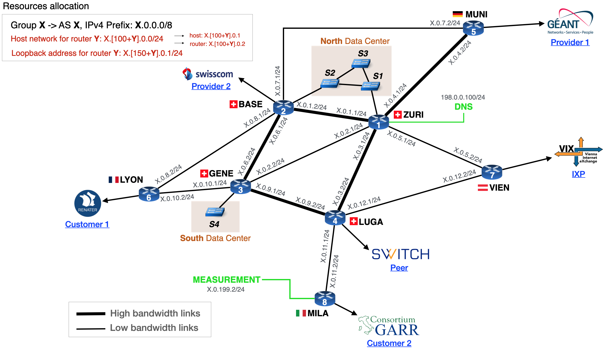
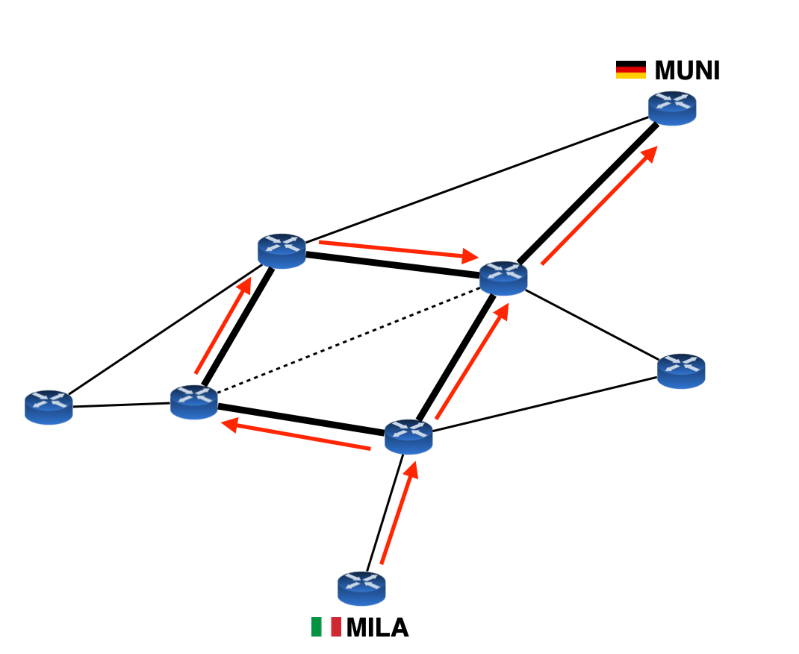

# Intra-Domain Routing

Now that all your hosts have been connected inside your data center, it is time to
configure intra-domain routing so that all the hosts can communicate with each other.

## Configure OSPF

Configure OSPF network-wide by establishing OSPF adjacencies between the routers.
Then, make sure to advertise all your IPv4 subnets (including the ones in the
North Data Center) into OSPF so as to enable end-to-end connectivity between
all the hosts in your AS.

> Obviously you will not have connectivity with the hosts in your South Data Center
> yet, as they currently have no IP addresses.

Before configuring OSPF, make sure that the interfaces of the routers are correctly configured.
Unlike earlier, you will need to use the IP addresses shown in the L3 topology diagram.

<details markdown="block">
<summary>Layer 3 topology Diagram </summary>



</details>

Every router also has a loopback interface with the name `lo` that you have to configure.
The router with ID Y has the loopback address `X.[150+Y].0.1/24`, where X
is the AS number and Y is the router ID.
Router IDs are shown on each router in the topology diagram, for example,
`LYON` for AS 10 is `10.156.0.1/24`.

{: .highlight }
Tutorial on how to [configure router interfaces](../tutorial/routing/routerinterfaces).

For the connection between the routers and their corresponding hosts, use have
to use the subnet `X.[100+Y].0.0/24`, where X is the AS number and Y is the router ID.
Then, the host gets the IP address `X.[100+Y].0.1` and the router gets the
IP address `X.[100+Y].0.2`.
For example, the subnet used for AS 10 between the `MILA` router and its
corresponding host is `10.110.0.0/24` with the host IP address `10.110.0.0.1`
and the router IP address `10.110.0.2/24`.

Be sure that each host can ping its directly connected router before you
start configuring OSPF.

{: .highlight }
Tutorial on how to [configure OSPF](../tutorial/routing/ospf).

Make sure that the subnet of the DNS server and the container are visible
in OSPF (for instance with `show ip route ospf`).
For more details on the DNS server and the measurement container check
the [tools](tools) section.

{: .important }
Do not modify the `dns` interface on `ZURI`, the `measurement` interface
on `MILA`, and the `matrix` interface on `LYON`.

From now on, you should prefer to launch a `traceroute` from the hosts
because they can use the DNS service (routers cannot).
If one host cannot access the DNS server because the OSPF configuration is
not ready yet, run `traceroute` with the option `-n` to avoid DNS resolution.

## Configure iBGP

After configuring OSPF, you need to configure iBGP between all pairs of routers.
Veryify that each one of your routers have an iBGP session with all the other
routers using the command `show ip bgp summary`.

When you establish the iBGP session, you must use the loopback address for
each endpoint of the connection. The loopback address is a virtual address
that is always up as long as the router is running.
Using the loopback address instead of any other physical interface
ensures that the BGP session remains up if a physical interface goes down.
To use loopback address for your BGP sessions, you will have to use the
`update-source` command when you configure your iBGP sessions.

{: .highlight }
Tutorial on how to [configure iBGP](../tutorial/routing/BGP).

## Optional: Configure your south data center

For this part, your goal is to enable hosts in the North Data Center to communicate
with hosts in the South Data Center using IPv6 through a 6in4 tunnel.
To do that, you will first need to configure an IPv6 address, as well as an IPv6
default gateway on the hosts of both Data Centers.
Then, as routing within your AS is only performed for IPv4, you will need
to configure a 6in4 tunnel between the routers of the two Data Centers.

### Configure IPv6 on the hosts

You will have to use one distinct prefix for each Data Center.
The prefix for the North Data Center is `X:200::/32` and the prefix for the
South Data Center is `X:201::/32`, where X is your AS number.
Within each Data Center, you are free to use any IPv6 address as long as
they are within these subnets.
Keep in mind that the FIFA and UEFA hosts are in different VLANS, and thus
for each Data Center, you should also divide your IPv6 subent into two
distinct subnets, one for each VLAN.

{: .highlight }
Tutorial on how to [configure hosts](../tutorial/configure-host).

### Configure the 6in4 tunnel

The 6in4 tunnel must be configured between `ZURI` and `GENE`.
With the 6in4 tunnel, when a host in the North Data Center sends an IPv6 packet
to a host in the South Data Center, `ZURI` encapsulates the packet into an
IPv4 header.
The packet is routed based on the IPv4 header to `GENE`, which decapsulates
the packet and forwards it to the destination host.

You will need to configure two 6in4 tunnels, one in each direction.

As it is not possible to configure a 6in4 tunnel on the FRR routers, you will
need to do this using the linux commands available with bash.
To run `bash` on a router instead of its CLI, use the `goto.sh` script and
write `container` instead of `router` or `host`.
From there, you can set up the 6in4 tunnel using the `ip` command.

To set up a tunnel you will need to run the following:

```bash
ip tunnel add TUNNEL_NAME mode sit remote REMOTE_ADDRESS local LOCAL_ADDRESS ttl 255
```

where `TUNNEL_NAME` is the name of the tunnel, `LOCAL_ADDRESS` and `REMOTE_ADDRESS`
are the ingress and egress addresses of the tunnel respectively.
Then, you will need to turn on the tunnel with the following command:

```bash
ip link set TUNNEL_NAME up
```

Finally, configure the routes that are reachable through the tunnel:

```bash
ip route add IPV6_PREFIX dev TUNNEL_NAME
```
where IPV6_PREFIX is the prefix of the remote network reachable through the tunnel.

To remove the tunnel, you can use the following command:

```bash
ip tunnel del TUNNEL_NAME
```

### Optional 2: Load balancing and backup

As a network operator, you must provide the best performance for your customers.
Here in particular, you expect a lof of traffic between provider 1 that is
connected to `MUNI` and customer 2 that is connected to `MILA`.
Besides the link `ZURI`-`GENE` will be used for the traffic between the two
Data Centers.
As a result you want it to be used only for backup, in case another link
in your network fails.

For this part, your goal is to leverage the high-bandwidth links in your
backbone network as shown in the figure below.
Configure the OSPF weights such that the traffic between `MILA` and `MUNI` is based is load-balanced
on the following two paths (and only these two):
- `MILA`-`LUGA`-`ZURI`-`MUNI`
- `MILA`-`LUGA`-`GENE`-`BASE`-`ZURI`-`MUNI`

Make sure to do this for both directions.
Then you must make also configure OSPF weights such that the link `ZURI`-`GENE`
is only used as backup.




# Related tutorials

- [Configure router interfaces](../tutorial/routing/routerinterfaces)
- [Configure OSPF](../tutorial/routing/ospf)
- [Configure iBGP](../tutorial/routing/BGP)